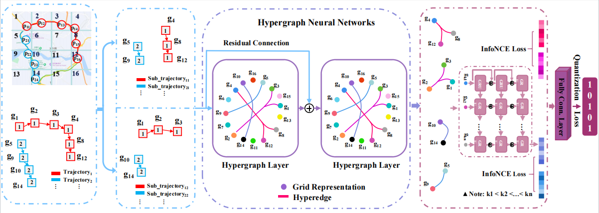
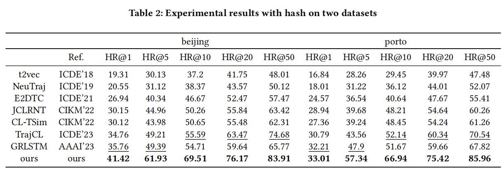

# HHL-Traj
Code of ''Hypergraph Hash Learning for Efficient Trajectory Similarity Computation(CIKM 2024)''

This is a PyTorch implementation of HHL-traj.

Author list: Lei Li, Yuan Cao, Xiangru Chen, Xue Xu, Zuojin Huang and Yanwei Yu	

## Overview
We provide an example to run our method on the porto/Beijing dataset.

download the [porto/Beijing] dataset from pan.baidu.com. The link is listed as follows:

<https://tianchi.aliyun.com/dataset/94216>

<https://www.microsoft.com/en-us/research/publicationt-drive-trajectory-datasample/>

Or you can download the data from the following address and move it to data fold.

<https://pan.quark.cn/s/02db8196c616>

The password is wL5E.


## environment

python 3.9.12

pytorch 1.12.1

cuda 11.3
## Framework
<div align=center>

</div>

## Experiment
<div align=center>

</div>

## If you want to reproduce the results, please follow the steps below

## data

Please download data.
Please open folder createData and run the corresponding Python file. If you want get Beijing database, please run the bj.ipynb. Then you need move it to data fold.

#### attention

Modify the corresponding file link.

If you want to use another dataset, please generate the corresponding file in the same way.

## Train
```shell
python Train.py
```

## Validation
```shell
python Validation.py
```

## Test
```shell
python Test.py
```

## result
The model will be saved in the saved_model and the result will be saved in the same level folder as test.py.
